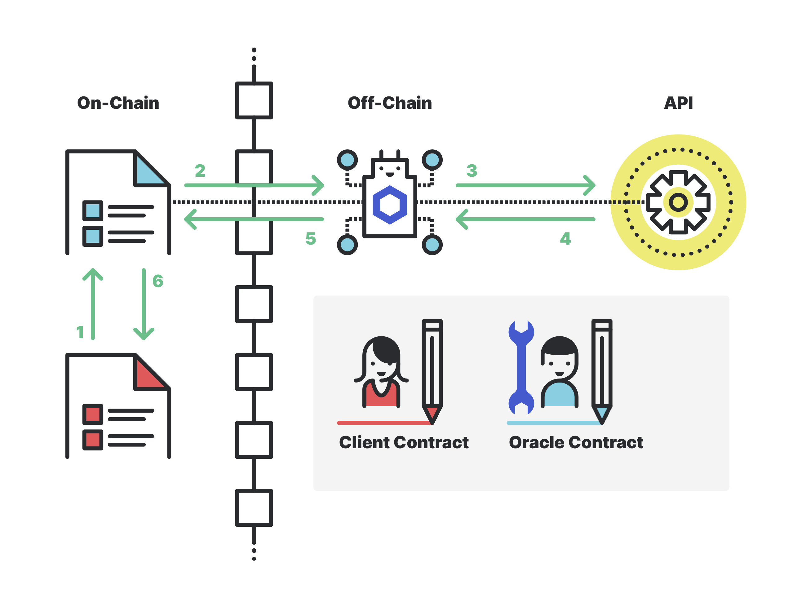

# NEAR <> Chainlink Oracle Demo

A simple front-end dApp demonstrating how smart contracts on NEAR can access off-chain data using [Chainlink Oracles](https://chain.link/).

- This example allows users to search for and retrieve a token's current market price in USD. 

On initial page load, the application auto-connects to the NEAR network using built in access keys configured by the dApp developer. When a search is performed, the application interacts with a `client` contract on NEAR by placing a contract call that invokes a method called `get_token_price`. This triggers the following chain of events:

1) `client` contract makes a call to the ***on-chain*** `oracle` contract
2) ***on-chain*** `oracle` makes a request to ***off-chain*** `oracle-node` (Chainlink)
3) Chainlink `oracle-node` makes a request to an API
4) API responds with the fulfilled token price request to the Chainlink `oracle-node` 
5) Chainlink `oracle-node` passes API response to the ***on-Chain*** `oracle` contract
6) ***on-chain*** `oracle` contract fulfills the original `client` contract request with the API's response

Both the `client` and ***on-chain*** `oracle` contracts were created & deployed on the NEAR network using [this walk-through](https://github.com/smartcontractkit/near-protocol-contracts) which can also provide a deeper look into the inner workings of the above steps.

We welcome community feedback & bug reporting so please let us know of any suggestions or issues you may have!